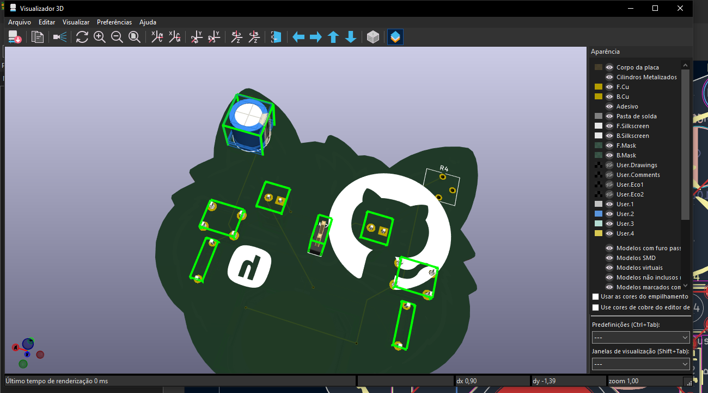
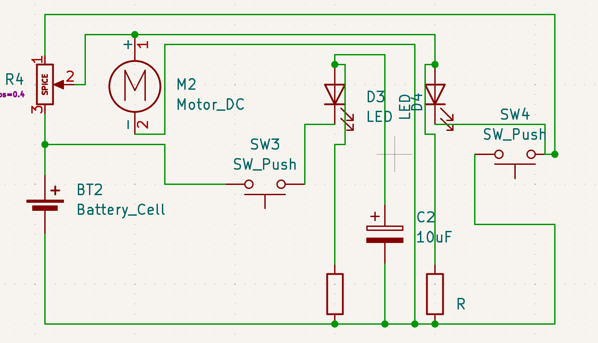
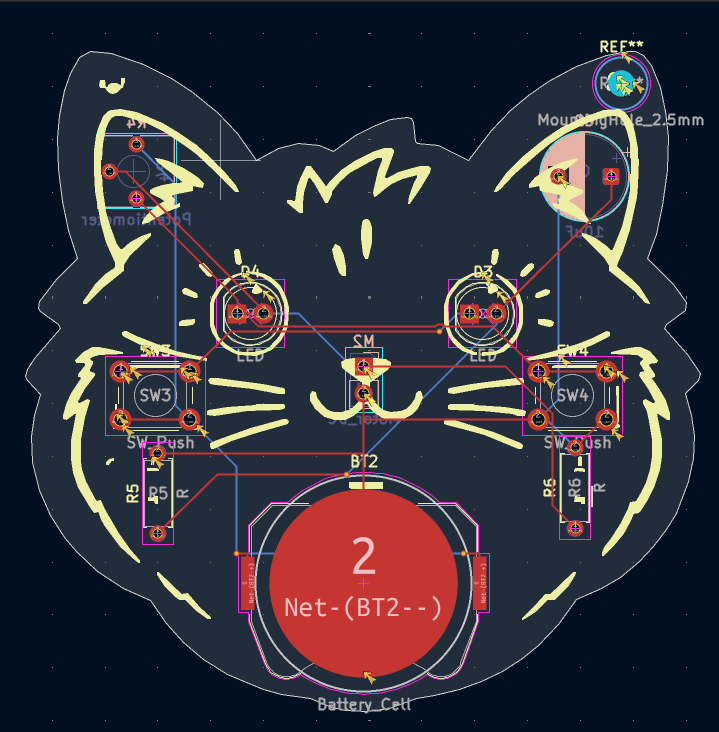
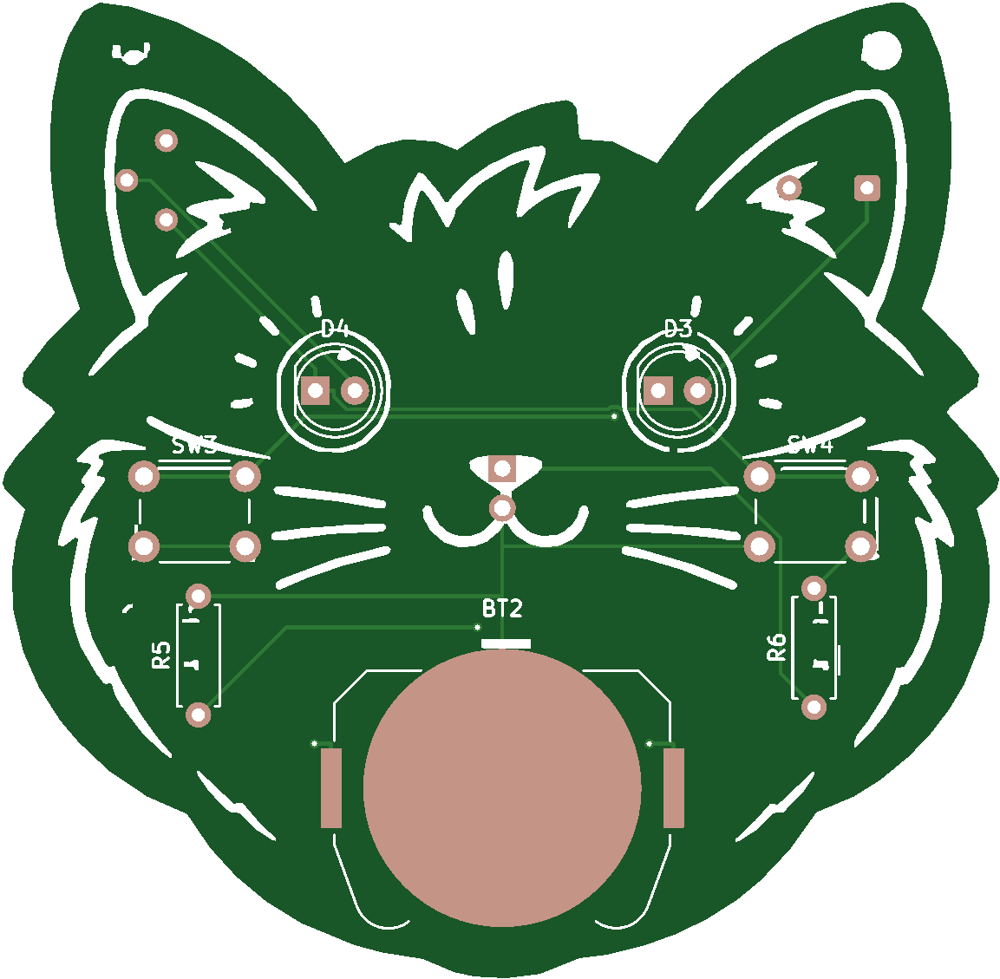
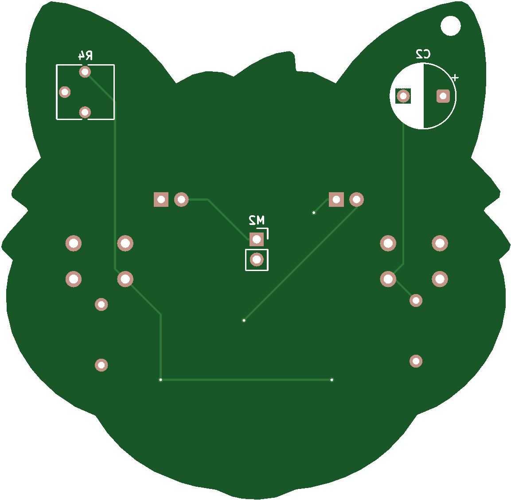
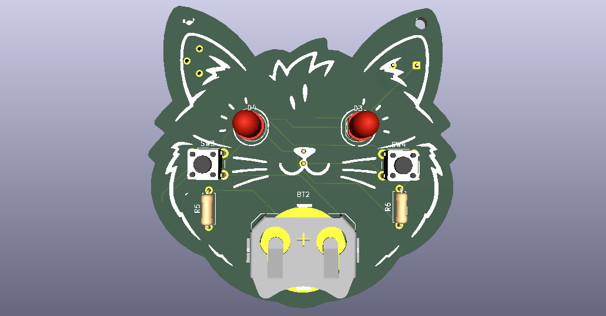

# Gato PCB

A printed circuit board (PCB) project developed in KiCad.

## Project Overview

A cat-themed PCB designed for the Hack Club Solder workshop. The board features LEDs, resistors, push buttons, a battery holder, a potentiometer, a capacitor, and a motor/pinheader connector — a hands-on beginner-friendly circuit for learning PCB design and soldering.

### Circuit Components

- **2x LED** — Visual indicators
- **2x Push Switch** — User input / interaction
- **2x Resistor** — Current limiting
- **1x Potentiometer** — Adjustable resistance / brightness control
- **1x Capacitor (10uF)** — Filtering / energy storage
- **1x Motor/PinHeader** — Motor driver interface
- **1x Battery Cell** — Power supply

## Visualizations

### UPDATE PCB SKILLSCREEN

### Schematic

### PCB Layout

### PCB Front View

### PCB Back View

### 3D View

---

## Bill of Materials (BOM)

| Ref | Qty | Component | Footprint |
|-----|-----|-----------|-----------|
| BT2 | 1 | Battery Cell | BatteryHolder_Keystone_3034_1x20mm |
| C2 | 1 | Capacitor (10uF) | CP_Radial_D8.0mm_P5.00mm |
| D3, D4 | 2 | LED | LED_D5.0mm |
| M2 | 1 | Motor/PinHeader | PinHeader_1x02_P2.54mm_Vertical |
| R4 | 1 | Potentiometer | Potentiometer_Vishay_T73YP_Vertical |
| R5, R6 | 2 | Resistor (R) | R_Axial_DIN0207_L6.3mm_D2.5mm_P7.62mm_Horizontal |
| SW3, SW4 | 2 | Push Switch | SW_PUSH_6mm |

*Full BOM available in [hardware/bom/gato-pcb.csv](hardware/bom/gato-pcb.csv)*

---

### Manufacturing

Gerber files for PCB fabrication are located in `hardware/gerbers/`. These include:
- Copper layers (F_Cu, B_Cu)
- Solder mask (F_Mask, B_Mask)
- Silkscreen (F_Silkscreen, B_Silkscreen)
- Edge cuts
- Drill files (PTH, NPTH)

## Author

- **Display Name:** Vini
- **Slack Username:** `o_dev`
